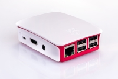
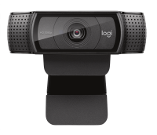

# Intel Movidius Neural Compute Stick Raspberry-Pi Webcam Installer
This project allows you to install a fully working person-detector using a single installation script.

We created this script so anyone can easily try this software/hardware out and experience what AI can do, to help you imagine what else you can do with it to help you in whatever project you're interested in!

More information in [our blog (NL)](https://www.devolksbank.nl/artikel/object-detection-on-a-stiiiiiiiiiick.html)





## Prerequisites
For this project you need (at least):
- a [Raspberry-Pi model 3B+](https://www.raspberrypi.org/products/raspberry-pi-3-model-b-plus/)
- a [power adapter for the Raspberry-Pi](https://www.raspberrypi.org/products/raspberry-pi-universal-power-supply/)
- a 64GB microSD card (32GB would also just work)
- a wifi connection
- an [Intel Movidius Neural Compute Stick](https://developer.movidius.com/)
- a monitor with an hdmi interface
- hdmi cable (or at least compatible with the Raspberry-Pi hdmi interface)
- usb keyboard + usb mouse
- a webcam (we used the Logitech C920)
- a power outlet ;)

And preferrably also:
- a separate device (laptop/desktop) to access the cam stream remotely

## Installation steps
For the installation, you need to perform the following steps

### 1) Start strech OS on the Raspberry-Pi
- download strech OS
- burn the iso onto the SD card, for example using Etcher
- put the SD card into the Raspberry-Pi
- connect the keyboard and mouse to the Raspberry-Pi
- use the hdmi cable to connect the monitor and the Raspberry-Pi
- use the power adapter to connect the Raspberry-Pi to a power outlet
- wait until it has started
- go to the preferences menu option on the Raspberry-Pi and start 'Raspberry Pi Configuration'
- go to the localisation tab en set your wifi country
- connect the Raspberry-Pi to your wifi using the icon on the top of your screen
- connect the compute stick and the webcam to the Raspberry-Pi

#### Enable ssh access
The easiest way to control the installation is from your PC/laptop, so it is advisable to enable SSH access on the pi, but you can also run everything on the Raspberry-Pi itself:
- go to the preferences menu option on the Raspberry-Pi and start 'Raspberry Pi Configuration'
- on the interfaces tab, enable 'ssh'
- check your IP address using `ifconfig` in a terminal
- on your PC/laptop, connect using `ssh pi@<ip>` using the default password `raspberry` (to be changed as you wish)

### 2) Update the firmware
Run in a terminal:
```
sudo rpi-update
```
And reboot afterwards:
```
sudo reboot
```

### 3) Clone this repository
```
git clone https://github.com/devolksbank/Raspberry-Pi-Movidius-Person-Detector
```

### 4) Call the installation script
The installation script can be called step-by-step, using:
```
chmod u+x install*
./install-step1-ncs-api.sh
./install-step2-image-classifier.sh
./install-step3-opencv.sh
./install-step4-webcam.sh
```

Or by the single-command installer:
```
chmod u+x install*
./install-full.sh
```

### 5) Test the installed streamer
First source the `~/.profile` to get the references to opencv right. Next, call:
```
cd ~/workspace/ncappzoo/caffe/NCS-Pi-Stream/ && python3 streamer_ncs.py
```

And watch the output via `http://localhost:8080/cam.mjpg` or remote via `http://<ip>:8080/cam.mjpg`.
Note that when watching via localhost, your Raspberry-Pi can quickly overheat!

## Thanks
Many thanks to the creators of these blogs/articles/repositories, which made creating this repository a lot easier:
- https://github.com/HanYangZhao/NCS-Pi-Stream
- https://www.pyimagesearch.com/2017/09/04/raspbian-stretch-install-opencv-3-python-on-your-raspberry-pi/

# Contact
For any questions please don't hesitate to contact us at [tc@devolksbank.nl](mailto:tc@devolksbank.nl)


